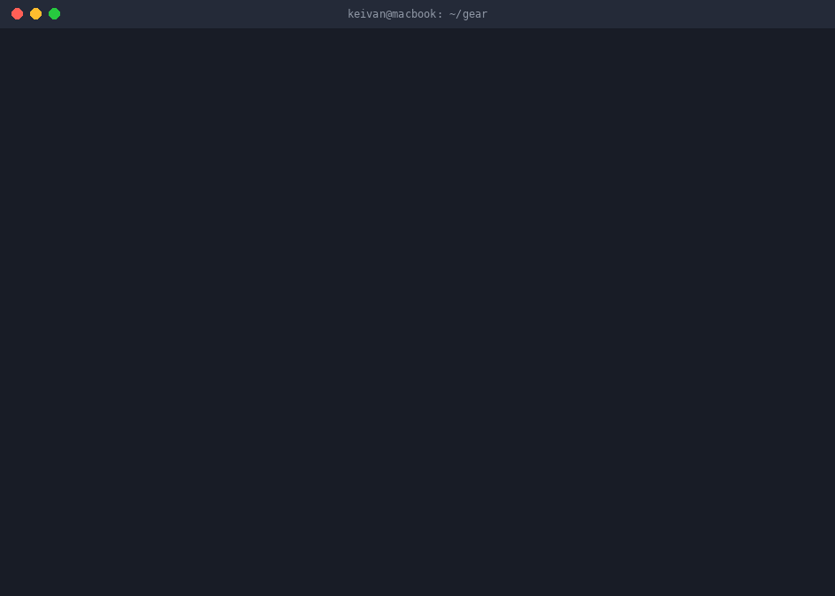

# gearwatch

[](https://github.com/keivanmalhani/gearwatch/actions/workflows/ci.yml)
[](LICENSE)
[](https://www.python.org/downloads/)
[](pyproject.toml)



**Used camera gear price tracking from official marketplace APIs.**

Tell gearwatch what you are hunting. It pulls completed-sale comparables from
the official eBay Browse and Marketplace Insights APIs, builds a price history
per model per condition, and tells you whether a live listing is actually a deal
against that model's own recent sold distribution.

*Read this in [Spanish / espanol](README.es.md).*

---

## Official APIs only. No scraping. Ever.

This is a hard architectural constraint, not a preference:

- **No scraping.** gearwatch never fetches a marketplace web page.
- **No HTML parsing.** There is no HTML parser in the codebase. The only HTML it
  touches is the dashboard it writes itself.
- **No headless browser.** No Selenium, no Playwright, no Puppeteer, no
  browser automation of any kind.
- **No undocumented endpoints.** Only the published, versioned, authenticated
  REST APIs that eBay documents for developers.
- **No credential material on disk.** Credentials come from environment
  variables, live in memory for the duration of a process, and are redacted out
  of every error, log line, and repr.

Every request goes through one rate-limited, retrying, caching client. If you
want to see the entire network surface of this program, read
`src/gearwatch/http.py`; there is nothing else.

## Why this exists

The used-gear market is opaque. Asking prices are noise: anybody can list a
lens for anything, and a listing that sits unsold for four months at 1,400 tells
you nothing except that 1,400 is too much. Sold prices are signal.

A p25 / median / p75 band per model, per condition, tracked over time, turns
"is 850 a good price for this?" into a number with a sample size attached. The
author resells gear, so this is a working tool rather than a demo, and it doubles
as a demonstration of real third-party API integration: OAuth2, pagination, rate
limiting, caching, and the boring correctness work that makes those safe.

## Zero runtime dependencies

gearwatch runs on the Python 3.11 standard library alone: `urllib.request`,
`json`, `sqlite3`, `argparse`, `statistics`, `hashlib`, `base64`, `time`, `re`,
`dataclasses`. Nothing to audit, nothing to vendor, nothing to pin, no supply
chain. `pytest` is the only development dependency.

## Quick start (no credentials needed)

The repository ships a realistic fixture, so the entire pipeline runs offline:

```
git clone https://github.com/keivanmalhani/gearwatch
cd gearwatch
python -m pip install -e ".[dev]"

gearwatch --db demo.db init
gearwatch --db demo.db watch add "Sony FE 35mm f/1.4 GM" \
    --max-price 900 --condition excellent --currency USD --require gm
gearwatch --db demo.db watch add "Fujifilm XF 56mm f/1.2 R" \
    --max-price 600 --condition excellent --currency USD

gearwatch --db demo.db sync --fixture fixtures/demo.json --days 90
gearwatch --db demo.db prices
gearwatch --db demo.db deals --min-score 60
gearwatch --db demo.db dashboard -o dashboard.html
```

### What that actually prints

```
gearwatch sync (source: fixture)
NOTE: fixture mode. This is canned data captured 2026-08-05T00:00:00Z, not live market data.
------------------------------------------------------------------------
[1] Sony FE 35mm f/1.4 GM
    source: fixture, pages fetched: 3
    sold comps: 22 seen, 20 stored, 20 new
    live listings: 5 seen, 3 stored, 3 new
    excluded: currency_mismatch=1, negative_token=1, title_mismatch=2
```

```
[1] Sony FE 35mm f/1.4 GM
    target: excellent, at or below 900.00 USD
    comps: 12 used of 13 fetched in this condition and currency
    outliers: 1 dropped outside the 1.5 IQR fence [812.50 USD .. 992.50 USD]: 320.00
    band:  min 860.00 USD | p25 883.75 USD | median 902.00 USD | p75 926.25 USD | max 950.00 USD
    trimmed mean (10 percent off each tail): 904.10 USD
    trend: down 45.00 USD (-4.9%) later half vs earlier half; 6 and 6 comps per half
    other conditions seen:
      like_new   no band - insufficient data: 2 completed sales, need at least 5
      good       no band - insufficient data: 4 completed sales, need at least 5
      parts      no band - insufficient data: 1 completed sale, need at least 5
```

```
[1] Sony FE 35mm f/1.4 GM (excellent, USD)
    band: p25 883.75 USD | median 902.00 USD | p75 926.25 USD  (12 comps (1 outlier dropped))
    [100] 849.00 USD  excellent  under p25 of recent sold, 12 comps  [under your max price, strong]
          Sony FE 35mm f/1.4 GM SEL35F14GM Lens - Excellent, Moving Sale
          item v1|405512340201|0
```

Note what did *not* appear: a 399.00 "FOR PARTS ONLY" listing, an 875.00
Sony 35mm **f/1.8**, an 850.00 EUR comp, and a 780.00 Zeiss 35mm f/1.4 **ZA**.
All four were excluded, and all four exclusions were counted and reported.

## The pricing methodology, stated honestly

All of this lives in `src/gearwatch/stats.py` and is pinned by hand-computed
tests.

### Percentiles

Linear interpolation on the sorted sample at rank `q * (n - 1)`. This is the
same definition numpy uses by default and it agrees with `statistics.median` at
the 50th percentile. It is chosen because you can verify it with a pencil, and
the test suite does exactly that.

### Outliers

Comps outside `p25 - 1.5 * IQR` to `p75 + 1.5 * IQR` are removed before the
headline band is computed. One "haze inside the front element" copy that went
for a third of the going rate will otherwise drag a median down by real money.

**Nothing is discarded silently.** The number dropped and the actual dropped
prices are printed in the report, shown on the dashboard, and carried on the
`PriceStat` object. Fences are inclusive, so a set of identical prices (IQR of
zero) keeps every value rather than declaring the whole sample an outlier.

### The refusal

**gearwatch will not publish a band from fewer than 5 completed sales.**
This is the single most important behaviour in the tool. Below the minimum,
`PriceStat.sufficient` is `False`, every price field is `None`, and the report
prints:

```
    band: NOT REPORTED - insufficient data: 3 completed sales, need at least 5
```

A median of three is not a market, it is an anecdote. Printing it with two
decimal places would give it an authority it has not earned. The threshold is
configurable with `--min-comps`, and it is applied again after outlier removal:
if dropping outliers takes the sample below the minimum, the band is withdrawn
and the reason says so.

The suite tests this at every count from 0 to 4, and tests that exactly 5 comps
does produce a band.

### Trimmed mean

The mean after dropping `floor(n * 0.1)` values from each tail. With fewer than
10 comps the trim count is zero and it degrades to the arithmetic mean, which is
stated rather than hidden.

### Trend

The comps are sorted by sale date, split into an earlier and a later half, and
the difference of the two medians is reported. This is a coarse instrument. When
either half has fewer than 6 comps the output is explicitly labelled
`weak signal`, with the per-half counts printed. It tells you which way the
market is leaning; it is not a forecast.

### Deal score

For a live listing, gearwatch finds where the asking price falls in the sold
distribution using the mid-rank method: `(below + 0.5 * equal) / n * 100`. A
price under every comp is percentile 0, above every comp is 100, and the deal
score is `100 - percentile`, so higher is a better buy.

The verdict is plain english and **always carries the sample size**:

- `under p25 of recent sold, 14 comps`
- `above the median, 7 comps, thin data, treat with caution`
- `not scored: insufficient data: 3 completed sales, need at least 5`

There is never a bare number. If the listing's condition grade differs from the
band's, the verdict says so. If the listing's currency differs from the band's,
the listing is not scored at all.

### Currency

gearwatch never converts currencies. A comp priced in a currency other than the
watch's is excluded and counted with the reason `currency_mismatch`. Applying
today's exchange rate to a sale that happened six weeks ago would be inventing
data, and inventing data is the one thing a pricing tool must not do.

## Title matching

Marketplace titles are filthy:

```
MINT!! Sony FE 35mm F1.4 GM SEL35F14GM Lens *READ*
SONY SEL35F14GM FE 35mm F/1.4 GM E-Mount Lens L@@K
Sony FE 35 mm f/1.4 GM Lens - Near Mint from Japan
```

`src/gearwatch/match.py` normalises all of those to the same token set:
lowercase, punctuation stripped, focal lengths canonicalised (`35 mm`, `35mm`,
`35MM` all become `35mm`), apertures canonicalised (`f/1.4`, `F1.4`, `f 1.4`,
and the compressed `F14` inside part codes all become `f1.4`), manufacturer part
codes expanded (`SEL35F14GM` also emits `35mm` and `f1.4`), and zoom ranges kept
intact so `24-70mm` is never chopped into `24` and `70mm`.

Matching then works in three stages:

1. **Negative tokens are absolute.** `for parts`, `not working`, `broken`,
   `as is`, `read`, `box only`, `hood only`, `replica` and friends disqualify a
   title outright. Add your own with `--exclude`, for example
   `--exclude "body only"` when you are tracking a kit.
2. **Required tokens must all be present.** By default these are the brand, the
   focal length, and the aperture. `--require gm` promotes an extra token, which
   is how the Zeiss 35mm f/1.4 **ZA** stays out of a G Master band.
3. **Optional tokens produce the score.** 70 points for satisfying every
   requirement, plus up to 30 more for optional-token overlap.

A 35mm f/1.8 can never match a watch for the 35mm f/1.4. There is a table of
dirty titles in `tests/test_match.py` covering both directions.

## Credentials

gearwatch reads credentials from **environment variables only**. There is no
flag, no config file, and no database column that can supply them.

```
export EBAY_CLIENT_ID=your-app-id
export EBAY_CLIENT_SECRET=your-cert-id

gearwatch auth check
```

`auth check` reports presence and names any missing variable. It never prints,
logs, hashes, or reveals the length of a value:

```
credentials: incomplete
  EBAY_CLIENT_ID: set
  EBAY_CLIENT_SECRET: MISSING
error: missing environment variable(s): EBAY_CLIENT_SECRET
```

### Getting eBay API keys

1. Create a free account at the [eBay Developers
   Program](https://developer.ebay.com/).
2. Create an application keyset. The **App ID (Client ID)** is
   `EBAY_CLIENT_ID` and the **Cert ID (Client Secret)** is
   `EBAY_CLIENT_SECRET`.
3. The Browse API (live listings) works with a standard production keyset.
4. The **Marketplace Insights API** (completed sales, the part that makes this
   tool useful) is a limited release. You must apply to eBay for access and be
   approved. Until then, run gearwatch in fixture mode. See the limitations
   section.

### The OAuth2 flow

gearwatch uses the client-credentials grant for application tokens:

- The client id and secret are sent as an HTTP Basic header to
  `https://api.ebay.com/identity/v1/oauth2/token`. They never appear in a URL,
  a query string, or a request body.
- The returned token is cached in memory with its absolute expiry.
- It is reused until it is within **60 seconds** of expiring, then refreshed.
- The token endpoint is POSTed with caching disabled. A cached token file would
  be a credential at rest that nobody asked for.

## Rate limits, retries, and caching

- **Token bucket limiter in front of every call.** The default is a deliberately
  conservative 1 request per second with a burst of 3. eBay grants far more than
  that; the point is to be a good citizen by default and let the operator raise
  it knowingly with `--rate`.
- **HTTP 429 is honoured.** `Retry-After` is parsed (both delta-seconds and
  HTTP-date) and respected, capped at 30 seconds. Without a `Retry-After`,
  backoff is exponential from 0.5 seconds with equal jitter (half fixed, half
  random) so retries never synchronise into a stampede.
- **5xx is retried, 4xx is not.** Retrying a 404 is just noise.
- **Retries give up.** After 4 retries the client raises `RetryExhausted` with
  the underlying error attached as `__cause__`.
- **Responses are cached on disk with a 6 hour TTL**
  (`DEFAULT_CACHE_TTL_SECONDS = 21600`). A used lens does not move meaningfully
  inside a day, so a re-run of `gearwatch sync` costs nothing. Disable with
  `--no-cache`, relocate with `--cache-dir` or `$GEARWATCH_CACHE_DIR`.

The cache key is `sha256(method + url + body)`. Headers are deliberately
excluded, which means two things: a token refresh does not invalidate the cache,
and no credential material can end up in a filename. Only `Content-Type` is
persisted from the response headers, so a stray `Set-Cookie` never lands on disk.

## Security

This is a portfolio piece and the security posture is meant to be exemplary.

| Property | How it is enforced | Where it is tested |
| --- | --- | --- |
| Credentials only from the environment | `Credentials.from_env` is the only constructor path used | `tests/test_auth.py` |
| No secret in a repr | `Credentials` and `Token` fields are `repr=False` with a custom `__repr__` | `tests/test_auth.py` |
| No secret in an exception | Every error message is passed through `redact()` before reaching `Exception.__init__`, so the secret is never in `args` | `tests/test_auth.py` |
| No secret in a log line | `RedactingFilter` is installed on the package logger | `tests/test_auth.py` |
| No bearer token anywhere | Registered secrets plus a regex that scrubs any `Bearer <...>` or `Basic <...>` even if unregistered | `tests/test_http.py` |
| No secret in the database | There is no token, secret, credential, or auth table. A test walks every cell of every table | `tests/test_db.py` |
| No secret on the response cache | Cache keys exclude headers; only `Content-Type` is persisted | `tests/test_http.py` |
| Dashboard makes no requests | Asserted by absence of `http`, `<script src`, `<link`, `url(` | `tests/test_dashboard.py` |
| The test suite cannot reach the network | An autouse fixture replaces `socket.socket` with a raise | `tests/conftest.py` |

The leak test uses a distinctive canary value, simulates a server that echoes
the submitted credentials back in an error body (the realistic way secrets end
up in logs and bug reports), and asserts the canary appears in neither
`str(exc)`, `repr(exc)`, nor the formatted traceback.

## The dashboard

`gearwatch dashboard -o dashboard.html` writes one self-contained file. Inline
CSS, inline JS, no CDN, no webfont, no analytics, no external reference of any
kind. Dark theme, single accent.

Per watch it shows the sold-price band as a hand-computed inline SVG box plot
(whiskers to min and max, box from p25 to p75, a line at the median, dots for
live listings), the comp count, the trend, the outliers that were dropped, and
the live listings ranked by deal score with the good ones highlighted. There is
a "data as of" timestamp in the header and a comp count next to every number.

The one deliberate trade: **there are no links to listings.** A dashboard that
phones out is not a self-contained dashboard, and any external URL would break
the offline guarantee. The marketplace item id is shown instead.

## Command reference

```
gearwatch [--db PATH] [--min-comps N] COMMAND

  init                                     create or migrate the database
  watch add QUERY [--max-price N]          add a watch
           [--condition C] [--currency C]
           [--marketplace M]
           [--require TOKEN ...]
           [--exclude TOKEN ...]
  watch list                               list watches
  watch remove ID                          remove a watch and its data
  sync [--fixture PATH] [--days N]         pull sold comps and live listings
       [--max-pages N] [--page-size N]
       [--watch ID] [--cache-dir PATH]
       [--no-cache] [--rate R]
  prices [--watch ID]                      the sold-price band report
  deals [--watch ID] [--min-score N]       live listings that beat the band
  dashboard [-o PATH] [--watch ID]         write the HTML dashboard
  auth check                               verify credentials are present
```

Conditions: `new`, `like_new`, `excellent`, `good`, `fair`, `parts`.

Exit codes: `0` success, `1` an expected failure you can act on (no
credentials, no watches, missing fixture), `2` a usage error.

`allow_abbrev` is disabled on the top-level parser **and on every subparser**,
so `--max` never silently becomes `--max-price` on a tool that spends money.
(argparse does not propagate that setting to subparsers; gearwatch routes every
subparser through a helper that sets it.)

Environment: `GEARWATCH_DB` sets the default database path,
`GEARWATCH_CACHE_DIR` the default response cache directory.

## Development

```
python -m venv .venv && . .venv/bin/activate
python -m pip install -e ".[dev]"
python -m pytest -q
```

**220 tests, 573 assertions, zero network calls.** The suite covers:

| Area | Tests | What it pins down |
| --- | --- | --- |
| `test_stats.py` | 32 | hand-computed percentiles, IQR removal, the refusal at counts 0-4 and the band at exactly 5, trimmed mean, zero-spread samples, rising and falling trends, deal percentiles |
| `test_match.py` | 50 | a table of dirty titles in both directions, aperture and focal variants, part-code expansion, near-miss models |
| `test_ebay.py` | 35 | fixture normalisation, pagination and its cap, currency exclusion, unknown condition ids |
| `test_http.py` | 29 | limiter spacing on an injected clock, 429 and `Retry-After`, retry exhaustion, TTL cache hits and expiry, timeouts, redaction |
| `test_cli.py` | 22 | the whole pipeline end to end in a temp dir, exit codes, `auth check` leakage |
| `test_db.py` | 19 | migrations, round trips, idempotent sync, no credential in any cell |
| `test_auth.py` | 18 | token caching, the 60 second refresh boundary, repr and exception redaction |
| `test_dashboard.py` | 15 | self-containment, SVG parses as XML, box plot geometry |

The demo fixture (`fixtures/demo.json`) holds 32 completed sales across two
models plus 8 live listings, and contains deliberate dirt: a price outlier, a
wrong-currency comp, a near-miss model, an unmapped condition id, and a
"for parts" listing. If the pipeline ever stops excluding one of those, the
tests fail.

## Limitations

Read these before trusting a number.

- **Completed-sale data requires approval.** eBay's Marketplace Insights API is
  a limited release. Without it you can still track live listings, but the sold
  distribution, which is the entire point, needs eBay to approve your
  application. Fixture mode exists partly for this reason.
- **Comps are marketplace-specific.** A band built from EBAY_US sales describes
  the US market on eBay. It does not describe KEH, MPB, FredMiranda, your local
  camera store, or eBay Germany. Do not port a band across marketplaces.
- **Condition labels are seller-reported and noisy.** One seller's "excellent"
  is another's "good". gearwatch maps eBay condition ids into six buckets and
  reports which bucket it used, but it cannot inspect the lens. Treat a
  condition-specific band as directional.
- **Small samples stay small.** For a rare model there may never be 5 comps in
  90 days. gearwatch will keep refusing rather than guess, which is correct, but
  it means the tool is most useful for gear that trades often.
- **Sold prices include shipping variation and best-offer opacity.** eBay
  reports the sale price; accepted best offers and shipping arrangements can sit
  underneath a number in ways the API does not expose.
- **The trend is two medians.** It is not a regression, it is not seasonally
  adjusted, and it says so every time it prints.
- **Aperture normalisation is a heuristic.** Two-digit codes are expanded
  (`F14` to `f1.4`) except for `11`, `16`, `22`, and `32`, which are far more
  likely to be genuine minimum-aperture markings. Unusual part numbers may
  normalise oddly. The rule is small, documented, and tested, but it is still a
  rule of thumb.
- **This is not financial advice** and gearwatch does not buy anything for you.

## License

MIT. Copyright (c) 2026 Keivan Malhani. See [LICENSE](LICENSE).
